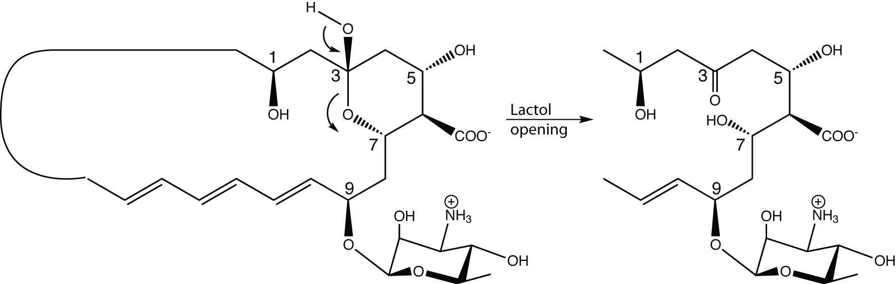
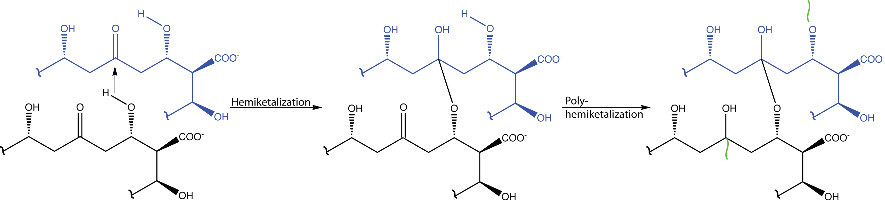
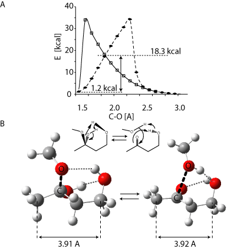
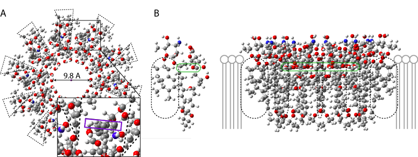

# A new proposition of mecanism of antifungal activity
## Opening of the hemiactal

View <a href='javascript:Jmol.script(JmolAppletA,"reset;");'>top</a>.

Spin axis 
<a href='javascript:Jmol.script(JmolAppletA,"rotation axis x;spin on");'>x</a>/
<a href='javascript:Jmol.script(JmolAppletA,"rotation axis x;spin on");'>y</a>/
<a href='javascript:Jmol.script(JmolAppletA,"rotation axis x;spin on");'>z</a>/
<a href='javascript:Jmol.script(JmolAppletA,"spin off");'>off</a>. 

Select <a href='javascript:Jmol.script(JmolAppletA,"select atomno <= 100;color [0,255,0]")'>on</a>/<a href='javascript:Jmol.script(JmolAppletA,"select atomno = 41;color [255,255,255]")'>off</a>.

Set
<a href='javascript:Jmol.script(JmolAppletA,"script APPLET * \"background white\"")'> white</a>/<a href='javascript:Jmol.script(JmolAppletA,"script APPLET * \"background black\"")'>black</a> background.
  
<a href='javascript:Jmol.script(JmolAppletA,"console")'>Cholesterol console</a>.
<code>print script("show orientation")</code>
]