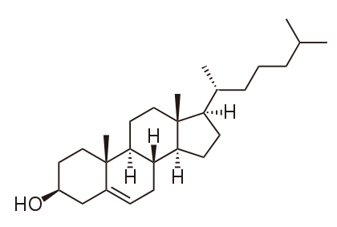

## Cholesterol and ergosterol

The cell membranes of many living organisms contain sterols. [Cholesterol](https://en.wikipedia.org/wiki/Cholesterol) is found in cell membranes of animals, [ergosterol](https://en.wikipedia.org/wiki/Ergosterol) in fungi and protozoa, and [phytosterols](https://en.wikipedia.org/wiki/Phytosterol) (including [campesterol](https://en.wikipedia.org/wiki/Campesterol), [sitosterol](https://en.wikipedia.org/wiki/Sitosterol), and [stigmasterol](https://en.wikipedia.org/wiki/Sitosterol)) in plants.

## Relevance of macrolide antibiotics

Because ergosterol is present in cell membranes of fungi, yet absent in those of animals, it is a useful target for antifungal drugs.[Ref](https://en.wikipedia.org/wiki/Ergosterol#Target_for_antifungal_drugs) Macrolide antibiotics such as Amphotericin B are target of ergosterol.[Ref](https://academic.oup.com/jac/article/49/suppl_1/7/2473430)

## Differences

Cholesterol and ergosterol have similar shapes. An important difference is the Hax(7) which is pointing out of the plane of cholesterol but is not present in ergosterol because of the additional double bound. This hydrogen atom (which can be <a href='javascript:Jmol.script(JmolAppletA,"select atomno = 41;color [0,255,0]")'>highlighted</a> in green in the structure) makes ergosterol more flat at the edge of ring B. The <a href='javascript:Jmol.script(JmolAppletA,"select atomno = 30, atomno = 48, atomno = 50;color [0,127,127]")'>other three additional</a> H of cholesterol can also be highlighted. The sidechain of ergosterol is less flexible because of the double bound and the additional <a href='javascript:Jmol.script(JmolAppletB,"select atomno = 65, atomno = 66, atomno = 67;color [127,127,0]")'>methyl</a> and shifted down a bit.

|Cholesterol|Ergosterol|
|----------|-----------|
|

 | 

|
|||

View <a href='javascript:Jmol.script(JmolAppletA,"reset; rotate z 33.34; rotate y 125.99; rotate z -67.45;select atomno = 41;color [0,255,0]");javascript:Jmol.script(JmolAppletB,"reset; rotate z -179.67; rotate y 93.62; rotate z -93.8; ")'>side</a>/<a href='javascript:Jmol.script(JmolAppletA,"reset;rotate z 118.48; rotate y 117.66; rotate z -47.64;select atomno = 41;color [0,255,0]");javascript:Jmol.script(JmolAppletB,"reset; rotate z -113.86; rotate y 135.11; rotate z -93.93;")'>top</a>. Synchronized cursors 
<a href='javascript:Jmol.script(JmolAppletA,"sync * on;sync * \"set syncMouse TRUE\"")'>on</a>/<a href='javascript:Jmol.script(JmolAppletA,"sync * off")'>off</a>.

Spin model 
<a href='javascript:Jmol.script(JmolAppletA,"spin on");javascript:Jmol.script(JmolAppletB,"spin on")'>on</a>/<a href='javascript:Jmol.script(JmolAppletA,"spin off");javascript:Jmol.script(JmolAppletB,"spin off");javascript:Jmol.script(JmolAppletB,"select atomno = 65, atomno = 66, atomno = 67;color [127,127,0]")'>off</a>. 
Highlight differences <a href='javascript:Jmol.script(JmolAppletA,"select atomno = 41;color [0,255,0];;spacefill 100;select atomno = 30, atomno = 48, atomno = 50;color [0,127,127];spacefill 100");;javascript:Jmol.script(JmolAppletB,"select atomno = 65, atomno = 66, atomno = 67;color [127,127,0];spacefill 100")'>on</a>/<a href='javascript:Jmol.script(JmolAppletA,"select atomno = 41;color [255,255,255];;spacefill 60;select atomno = 30, atomno = 48, atomno = 50;color [255,255,255]";spacefill 60);javascript:Jmol.script(JmolAppletB,"select atomno = 65, atomno = 66, atomno = 67;color [255,255,255];;spacefill 60")'>off</a>.

Set
<a href='javascript:Jmol.script(JmolAppletA,"script APPLET * \"background white\"")'> white</a>/<a href='javascript:Jmol.script(JmolAppletA,"script APPLET * \"background black\"")'>black</a> background.

Electronic densities <a href='javascript:Jmol.script(JmolAppletA,"select all ;;if ({atomno < 10}.partialcharge == 0){calculate partialcharge};isosurface vdw map mep;");javascript:Jmol.script(JmolAppletB,"select all ;;if ({atomno < 10}.partialcharge == 0){calculate partialcharge};isosurface vdw map mep;");'>on</a>/<a href='javascript:Jmol.script(JmolAppletA,"select all;isosurface off;");javascript:Jmol.script(JmolAppletB,"select all;isosurface off");'>off</a>.

<a href='javascript:Jmol.script(JmolAppletA,"console")'>Cholesterol</a>/<a href='javascript:Jmol.script(JmolAppletB,"console")'>ergosterol</a> console.
<code>print script("show orientation")</code>
