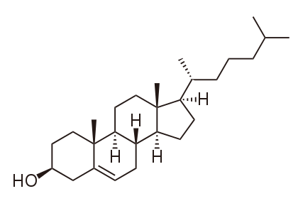

## Cholesterol and ergosterol
Sterols are found in the cell membranes of many living organisms. [Cholesterol](https://en.wikipedia.org/wiki/Cholesterol) is found in cell membranes of animals, [ergosterol](https://en.wikipedia.org/wiki/Ergosterol) in fungi and protozoa, and [phytosterols](https://en.wikipedia.org/wiki/Phytosterol) in plants.
## Relevance of macrolide antibiotics
Because ergosterol is present in cell membranes of fungi, yet absent in those of animals, it is a useful target for antifungal drugs.[Ref](https://en.wikipedia.org/wiki/Ergosterol#Target_for_antifungal_drugs) Macrolide antibiotics such as Amphotericin B are target of ergosterol.[Ref](https://academic.oup.com/jac/article/49/suppl_1/7/2473430)
## Differences
Cholesterol and ergosterol have similar shapes, but the Hax(7) which is pointing out of the plane of cholesterol is not present in ergosterol because it has a sp2 hybridisation. This hydrogen atom can be highligheted in the structures of Table 1. 

|Cholesterol|Ergosterol|
|-----|-----|
|

|

|
|||
|View <a href='javascript:jmolScript("reset; rotate z 33.34; rotate y 125.99; rotate z -67.45;select atomno = 41;color [0,255,0]", "A")'>side</a>/<a href='javascript:jmolScript("reset;rotate z 118.48; rotate y 117.66; rotate z -47.64;select atomno = 41;color [0,255,0]", "A")'>top</a>|View <a href='javascript:jmolScript("reset; rotate z -179.67; rotate y 93.62; rotate z -93.8;", "B")'>side</a>/<a href='javascript:jmolScript("reset; rotate z -113.86; rotate y 135.11; rotate z -93.93;", "B")'>top</a>|

View <code><a href='javascript:jmolScript("reset; rotate z 33.34; rotate y 125.99; rotate z -67.45;select atomno = 41;color [0,255,0]", "A");javascript:jmolScript("reset; rotate z -179.67; rotate y 93.62; rotate z -93.8;", "B")'>side</a></code>/<code><a href='javascript:jmolScript("reset;rotate z 118.48; rotate y 117.66; rotate z -47.64;select atomno = 41;color [0,255,0]", "A");javascript:jmolScript("reset; rotate z -113.86; rotate y 135.11; rotate z -93.93;", "B")'>top</a></code>. 
 Spin
    <code><a href='javascript:jmolScript("spin on", "A");javascript:jmolScript("spin on", "B")'>on</a></code> /
    <code><a href='javascript:jmolScript("spin off", "A");javascript:jmolScript("spin off", "B")'>off</a></code>. 
  

Highlight Hax(7) cholesterol <code><a href='javascript:jmolScript("select atomno = 41;color [0,255,0]", "A")'>on</a></code>/
<code><a href='javascript:jmolScript("select atomno = 41;color [255,255,255]", "A")'>off</a></code>. 
Set 
<code><a href='javascript:jmolScript("script APPLET * \"background white\"","A")'> white</a></code>/
<code><a href='javascript:jmolScript("script APPLET * \"background black\"","A")'> black</a></code> background.
  
<a href='javascript:jmolScript("console","A")'>Cholesterol</a>/
<a href='javascript:jmolScript("console","B")'>ergosterol console</a>.
<code>print script("show orientation")</code>
[Version of this page with synchronized rotation](page2.html)

